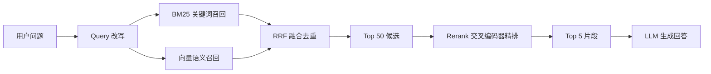

纯向量检索有个反直觉的短板：它擅长「意思相近」，却常常漏掉「字面精确」的东西。搜「RAGAS 评测标准」，向量可能把 RAGAS 这个专有名词模糊掉，召回一堆泛泛的 RAG 评测文章，反而找不到真正写着 RAGAS 的那一篇。

所以成熟的 RAG 不会只靠向量，而是「关键词 + 向量」双路召回，再用 rerank 精排。这三步决定了最终喂给模型的是不是「对」的片段。

## 一、两种召回互补

| 维度 | BM25 关键词检索 | 向量语义检索 |
| --- | --- | --- |
| 擅长 | 精确词匹配（编号、型号、专名） | 语义相近（同义改写、口语化） |
| 短板 | 同义词、换说法就找不到 | 精确字符串、低频专名 |
| 匹配单位 | 词项 token | 语义向量 |

关键词检索补向量漏掉的「精确」，向量补关键词漏掉的「同义」。两者单独用都不够稳，合起来才完整。

## 二、融合用 RRF，别硬加权

把两路结果合成一个列表，最常见的做法是给分数加权：

```python
score = alpha * bm25_score + beta * dense_score
```

问题是：BM25 分数和向量相似度的**分布完全不一样**——一个是几十上百，一个被压在 0 到 1。alpha、beta 很难调，换模型、换数据又得重新调。

更稳的是 **RRF（Reciprocal Rank Fusion，倒数排名融合）**，它不看分数，只看排名：

```python
def rrf_fuse(ranked_lists, k=60):
    """ranked_lists: 每个召回源返回的 doc_id 排序列表"""
    score = {}
    for lst in ranked_lists:
        for rank, doc_id in enumerate(lst):
            score[doc_id] = score.get(doc_id, 0) + 1.0 / (k + rank + 1)
    return sorted(score.items(), key=lambda x: -x[1])
```

只关心「排第几」，不关心「分数多大」，天然抗分布差异，几乎不需要调参。

## 三、rerank：召回求快，精排求准

双路召回后可能拿到几十条候选（比如 Top 50）。直接全塞给 LLM 太长、太贵，也容易稀释注意力。这时用 **rerank 重排模型**精挑出最相关的 5 条。

召回和精排是两种不同的模型分工：

- **召回**用双塔模型（query 和 doc 各自编码，靠向量点积算相似度）——快，但精度有限；
- **精排**用交叉编码器（cross-encoder），把 query 和 doc 拼在一起输入模型，直接输出相关分——准，但慢。

所以只在召回出的小候选集上做精排，就能兼顾「快」和「准」：

```python
from FlagEmbedding import FlagReranker

reranker = FlagReranker('BAAI/bge-reranker-v2-m3', use_fp16=True)
pairs = [[query, doc] for doc in candidates]
scores = reranker.compute_score(pairs, normalize=True)
top = sorted(zip(candidates, scores), key=lambda x: -x[1])[:5]
```

## 四、完整链路



## 落点

检索质量是 RAG 的胜负手，而且**不止靠调 embedding**：关键词 + 向量双路召回补齐「精确」与「语义」，RRF 无痛融合，rerank 在精排阶段把关。这三步做对，比把 embedding 从 A 换到 B 的提升大得多。

先召回、再精排，是搜索系统几十年的老套路，RAG 只是把它接到了 LLM 前面。
